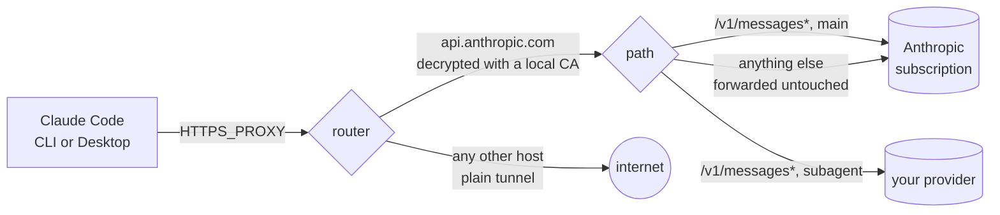

# subagent-handoff

Keep your Claude Code main conversation on your claude.ai subscription while
routing subagent traffic to a third-party provider you pay for separately.

<p>
  <a href="https://github.com/1morr/subagent-handoff/actions/workflows/test.yml"></a>
  <a href="LICENSE"></a>
  
</p>

**English** · [繁體中文](README.zh-Hant.md)

ultracode and Workflow fan out dozens of subagents at once, and a claude.ai
subscription's 5-hour limit does not survive that. The subagents are the bulk
of the tokens but not the part where reasoning quality matters most, so this
router sends them to a cheaper provider and leaves the main conversation on
the subscription, untouched.

> [!WARNING]
> **Read this before using it.**
> - **Unofficial.** Not affiliated with, endorsed by, or sponsored by Anthropic PBC.
>   Anthropic explicitly does not support pointing Claude Code at non-Claude models.
>   If it breaks, you fix it.
> - **Your data goes to the third party in full.** Every routed request carries the
>   whole payload — system prompt, your source code, file contents, tool output.
>   Route subagents somewhere you would be comfortable sending your repository.
> - **Your claude.ai OAuth token passes through this local proxy.** It is forwarded
>   to Anthropic unchanged and is never sent to a third-party provider
>   ([the code that guarantees it](src/proxy.mjs), and the test that pins it).
> - Third-party usage is billed to your own API key. This tool does not modify or
>   spoof any billing identity, and does not bypass anyone's usage limits. Check
>   it against your terms with each provider. Use at your own risk.


## Why this works

From Claude Code's own [LLM gateway docs](https://code.claude.com/docs/en/llm-gateway):

> **Setting only that variable** (`ANTHROPIC_BASE_URL`)**, without a gateway
> credential, doesn't replace the subscription.** Requests still route through
> the gateway, but a saved claude.ai login remains the active credential, so its
> usage limits and billing apply.

So as long as you do **not** set `ANTHROPIC_AUTH_TOKEN`, `ANTHROPIC_API_KEY`, or
`apiKeyHelper`, Claude Code sends its subscription OAuth token to this router,
and the router decides per request whether it goes to Anthropic (subscription
pays) or to a third party (your API key pays).

The split is made on a header from the
[gateway protocol](https://code.claude.com/docs/en/llm-gateway-protocol):

> `x-claude-code-agent-id` — Identifier of the subagent that issued the request,
> **present only on requests from an agent Claude Code spawned inside the session**.

Matching on the header rather than the model name matters because Workflow's
`agent()` only accepts the `sonnet | opus | haiku | fable` aliases — you cannot
name a third-party model inside a workflow script at all.

## Quick start

Node 20+. No npm dependencies.

```bash
git clone https://github.com/1morr/subagent-handoff.git
cd subagent-handoff
npm start
```

The first run creates `config.json`. **Nothing is routed out of the box** — the
default "all subagents" rule ships disabled, because with no provider key yet,
enabling it would just 401 every subagent.

Open <http://127.0.0.1:8788>:

1. **Providers** — enter Base URL, API Key and Model, click **Run test**, and
   confirm every **Required** check passes. A failing **Capability** check
   does not stop Claude Code from working, but that capability silently fails
   for subagents; see [the built-in tests](docs/providers.md#內建的測試).
2. **Routing** — tick the "all subagents → your provider" rule to enable it.
3. **Connect** — copy the `settings.json` snippet and restart Claude Code.
4. Run `/status` and confirm `Login method` still points at your claude.ai account.
5. Give a subagent some work, then watch the split on the **Rack** tab.

## HTTPS proxy mode (optional, for Claude Desktop)

**Off by default**, and while it is off the router behaves exactly as described
above. Turn it on only if you want Claude Desktop routed too.

**Why:** Claude Desktop's Code tab ignores `ANTHROPIC_BASE_URL`, so it never
reaches the router. It does honour `HTTPS_PROXY` and `NODE_EXTRA_CA_CERTS`.

**How:** off, Claude Code *sends* its API requests to the router. On, Claude Code
thinks it talks to Anthropic directly, and the router picks the connection up as
an HTTPS proxy:



The `/v1/messages*` routing is the same code in both modes; only the way requests
get in differs.

| | Off (default) | On |
|---|---|---|
| Clients | CLI | CLI and Claude Desktop |
| Claude Code settings | `ANTHROPIC_BASE_URL` | `HTTPS_PROXY` + `NODE_EXTRA_CA_CERTS` |
| Through the router | API requests only | every HTTPS connection of Claude Code and the programs it starts; only `api.anthropic.com` is decrypted |
| Router down | API requests fail | Claude Code, git, npm… lose all network access |
| Local CA | none | one, name-constrained to `api.anthropic.com` |

**To turn it on:** tick the switch at the top of the **Connect** tab (or set
`"httpsProxy": true`), save, restart the router, then paste the snippet the tab
shows. Turning it off again means putting `ANTHROPIC_BASE_URL` back.

**Account risk:** nobody can promise it is safe. In both modes the subscription
requests keep your token and body but leave from the router, with Node's TLS
fingerprint and two headers Node's `fetch` adds. With the mode on, sign-in,
telemetry, Remote Control and voice also leave from Node. Measured details, the
full diagrams, global vs per-repo setup and the risk write-up:
[docs/https-proxy.md](docs/https-proxy.md).

## The two request kinds

| Condition | How it is detected | Who it is |
|---|---|---|
| `main` | No `x-claude-code-agent-id` | You typing in the prompt box |
| `subagent` | Has `x-claude-code-agent-id` | Any agent Claude Code spawned. **Workflow and ultracode `agent()` calls are all here**, and so are agents a subagent spawns in turn |

Background requests without an agent id count as `main` and follow the `main`
rules: session titles, compaction, the quota probe, and **the auto mode permission
classifier** — even when it is judging a subagent's action. Route `main` to a
provider and auto mode is judged by that provider's model, not by Claude. Every
request type and where it goes, measured: [docs/request-map.md](docs/request-map.md).

## Configuration

The GUI is a complete front end for `config.json`; everything is editable there.
Rules are evaluated top to bottom and the first match wins.

| Field | |
|---|---|
| `proxyPort` / `adminPort` | 8787 and 8788. Changing them needs a restart; everything else takes effect per request |
| `httpsProxy` | HTTPS proxy mode for Claude Desktop, default `false`. Needs a restart, like the ports |
| `providers[].baseUrl` | Must speak the Anthropic Messages format — the router posts to `{baseUrl}/v1/messages` |
| `providers[].model` | Rewrites `model` before sending. Empty = leave alone |
| `providers[].authStyle` | `bearer` or `x-api-key` |
| `rules[].match` | `main` or `subagent`, optionally narrowed by `modelGlob` |
| `rules[].providerId` | Which provider, or the reserved value `passthrough` to send it back to the subscription |
| `rules[].modelOverride` | Rewrites `model`, beating `providers[].model`. Works on `passthrough` too |

Unmatched requests go to `https://api.anthropic.com` with their credentials
unchanged; that target is fixed. Full reference, including what an older
`config.json` loses on its next save: [docs/configuration.md](docs/configuration.md).

**Two things worth knowing.** When a third-party quota runs dry, switch that
rule's target to `passthrough` rather than disabling it — disabling drops traffic
through to the *next* rule, while pointing at passthrough actually parks it on
the subscription. And `modelOverride` is the only way to give subagents a
different model from the main conversation, since `agent()` inherits the main
model when none is specified and you cannot change that from Claude Code's side.

## What the router changes

Every request takes exactly one of two lines. There are no settings for any of
this.

| | Subscription line | Provider line |
|---|---|---|
| Which requests | The main conversation, anything no rule matches, rules pointing at `passthrough`, and anything that is not a JSON `/v1/messages*` request | Requests matched by a rule that points at a provider |
| Sent to | `https://api.anthropic.com` + the original path and query | `{baseUrl}` + the original path and query |
| Headers | Forwarded as-is, minus `host`, hop-by-hop headers and `accept-encoding` | Rebuilt from scratch: `content-type`, the provider's own key, and `anthropic-version`, `anthropic-beta`, `accept` copied from Claude Code. Your OAuth token, cookies and `x-claude-code-*` headers are never sent |
| Body | The original bytes. Only a rule's `modelOverride` rewrites `model` | `model` rewritten (rule `modelOverride`, then provider `model`), `metadata` removed, and `\0` inside a tool schema's `pattern` swapped for the equivalent `\x00` (DeepSeek cannot compile the former). Everything else is untouched: `thinking`, `output_config`, `context_management`, `cache_control`, mid-conversation `system` messages |
| Response | Passed through as it streams | Passed through as it streams, except one error: a context overflow in OpenAI wording is reworded to `prompt is too long: <requested> tokens > <limit> maximum`, numbers kept, so Claude Code compacts instead of failing |

On both lines the router never retries — Claude Code already does. If the
upstream cannot be reached it answers `502`; if a stream breaks midway it drops
the connection so Claude Code resends; a body over 64 MiB gets `413`. None of
the rewrites touch the cached prompt prefix, and removing `metadata` lets
DeepSeek reuse its cache across sessions. Every rewrite shows up per request
under **Rewritten before sending** in the traffic log. Details:
[docs/providers.md](docs/providers.md#router-對請求改了什麼),
[docs/reliability.md](docs/reliability.md).

## Security model

- Both servers bind to `127.0.0.1` only.
- The admin API validates `Origin` and `Host`, so a web page cannot drive it and
  DNS rebinding does not work.
- Stored API keys are never returned to the browser — the GUI receives a masked
  hint and a `__keep__` sentinel.
- `config.json` and `traffic.log` are written `0600`.
- The traffic log records metadata only: no request bodies, no headers, no
  credentials.
- Provider requests are built from an empty header set — only `anthropic-version`,
  `anthropic-beta` and `accept` are copied over — so no client credential can be
  forwarded by accident. A test asserts this.
- Provider requests have `metadata` removed: Claude Code puts your claude.ai
  `account_uuid` and `device_id` in it. The subscription line is untouched. A
  test asserts this.
- HTTPS proxy mode's CA can only sign `api.anthropic.com` (`nameConstraints`), its
  key is written `0600`, and it is never installed system-wide. A test proves a
  certificate it signs for another host is rejected.

Details and the threat model: [docs/security.md](docs/security.md).

## Development

```bash
npm test     # node --test, no dependencies, no network
```

Zero runtime and dev dependencies is a deliberate constraint — please keep it.
CI runs the suite on Node 20/22/24 across Ubuntu and Windows.

## Documentation

The in-depth docs are written in Traditional Chinese.

| | |
|---|---|
| [docs/configuration.md](docs/configuration.md) | Every config field, the fixed values, and what older config files lose |
| [docs/routing.md](docs/routing.md) | Rule matching, model overrides, quota switching |
| [docs/observability.md](docs/observability.md) | The traffic log, cache hit rates, and reading the rack |
| [docs/reliability.md](docs/reliability.md) | Why the router hands failures straight back to Claude Code, and mid-stream disconnects |
| [docs/providers.md](docs/providers.md) | Provider compatibility notes, the built-in tests, and measurements |
| [docs/claude-code-request-shapes.md](docs/claude-code-request-shapes.md) | The request shapes Claude Code v2.1.274 actually sends and how DeepSeek handles each |
| [docs/security.md](docs/security.md) | Threat model and what is and is not protected |
| [docs/request-map.md](docs/request-map.md) | Every request Claude Code sends, how it is classified and where it goes in each mode, including the auto mode classifier |
| [docs/https-proxy.md](docs/https-proxy.md) | HTTPS proxy mode for Claude Desktop: how it works, the local CA, measurements, pitfalls |

## License

[MIT](LICENSE)
