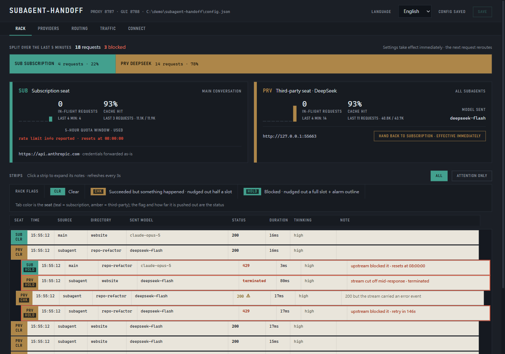

# subagent-handoff

讓 Claude Code 的主對話繼續走你的 claude.ai 訂閱，同時把子代理（subagent）的流量導到你另外付費的第三方供應商。

<p>
  <a href="https://github.com/1morr/subagent-handoff/actions/workflows/test.yml"></a>
  <a href="LICENSE"></a>
  
</p>

[English](README.md) · **繁體中文**

> [!WARNING]
> **使用前請先讀完這一段。**
> - **非官方工具。** 與 Anthropic PBC 沒有任何隸屬、背書或贊助關係。
>   Anthropic 明確表示不支援把 Claude Code 指向非 Claude 的模型。
>   壞了，要自己修。
> - **你的資料會完整送到第三方手上。** 每一個被路由出去的請求都帶著完整內容 ——
>   system prompt、你的原始碼、檔案內容、工具輸出，全部都在裡面。
>   選擇路由子代理的目的地時，請只選你願意把整個 repository 送過去的地方。
> - **你的 claude.ai OAuth token 會經過這個本機 proxy。** 它會原封不動地轉發給
>   Anthropic，絕對不會送到任何第三方供應商
>   （[保證這件事的程式碼](src/proxy.mjs)，以及釘住這個行為的測試）。
> - 第三方用量會計入你自己的 API key。這個工具不會修改或偽造任何帳務身分，
>   也不會繞過任何人的用量限制。請自行對照每個供應商的條款確認合規性。
>   使用風險自負。

使用情境是這樣的：ultracode 與 Workflow 會一次展開好幾十個子代理，很快就把 5 小時額度燒光。把這些流量送到便宜的供應商，主對話的推理品質完全不受影響。



## 為什麼這樣可行

引用自 Claude Code 官方的 [LLM gateway 文件](https://code.claude.com/docs/en/llm-gateway)：

> **Setting only that variable** (`ANTHROPIC_BASE_URL`)**, without a gateway
> credential, doesn't replace the subscription.** Requests still route through
> the gateway, but a saved claude.ai login remains the active credential, so its
> usage limits and billing apply.

所以只要你**不**設定 `ANTHROPIC_AUTH_TOKEN`、`ANTHROPIC_API_KEY` 或 `apiKeyHelper`，Claude Code 就會把它的訂閱 OAuth token 送給這個 router，router 再依每個請求決定要送去 Anthropic（訂閱額度支付）還是第三方（你的 API key 支付）。

這個分流判斷依據的是 [gateway protocol](https://code.claude.com/docs/en/llm-gateway-protocol) 裡的一個 header：

> `x-claude-code-agent-id` — Identifier of the subagent that issued the request,
> **present only on requests from an agent Claude Code spawned inside the session**.

用 header 判斷、而不是用 model 名稱判斷，這件事很重要，因為 Workflow 的 `agent()` 只接受 `sonnet | opus | haiku | fable` 這幾個別名 —— 你在 workflow script 裡根本沒辦法指名一個第三方模型。

## 快速開始

Node 20+。沒有任何 npm 依賴套件。

```bash
git clone https://github.com/1morr/subagent-handoff.git
cd subagent-handoff
npm start
```

第一次執行會建立 `config.json`。**預設什麼都不會被路由出去** —— 內建的「all subagents」規則出廠時是停用的，因為在還沒填供應商 key 的情況下，啟用它只會讓每個子代理都收到 401。

打開 <http://127.0.0.1:8788>：

1. **Providers** —— 填入 Base URL、API Key 與 Model，然後跑一次連線測試。
2. **Routing** —— 勾選「all subagents → your provider」規則來啟用它。
3. **Connect** —— 複製 `settings.json` 片段，重新啟動 Claude Code。
4. 執行 `/status`，確認 `Login method` 仍然指向你的 claude.ai 帳號。
5. 派一個子代理去做點事，然後在 **Rack** 分頁看分流結果。

想在沒有任何 API key 或網路連線的情況下，看到 GUI 裡有資料可以看：

```bash
npm run demo      # synthetic traffic against a local fake upstream
```

## 三種請求類型

| Condition | How it is detected | Who it is |
|---|---|---|
| `main` | 兩個 header 都沒有 | 你在輸入框裡打字 |
| `subagent` | 帶有 `x-claude-code-agent-id` | 第一層 agent。**Workflow 與 ultracode 的 `agent()` 呼叫全部落在這裡** |
| `nested` | 還多帶了 `x-claude-code-parent-agent-id` | 一個又派生出另一個 agent 的子代理 |

**要涵蓋 ultracode，你的規則必須匹配 `subagent`。** Workflow 的 agent 不帶 parent header，所以 `nested` 一個都抓不到 —— 在純 ultracode 的 session 裡，`nested` 根本永遠不會觸發。

## 設定

這個 GUI 是 `config.json` 的完整前端介面，所有東西都能在裡面編輯。規則會由上到下依序判斷，第一個符合的就採用。

| Field | |
|---|---|
| `proxyPort` / `adminPort` | 8787 與 8788。改這兩個需要重新啟動；其他所有設定都是逐請求即時生效 |
| `passthrough.baseUrl` | 沒匹配到任何規則的請求會送去哪裡。預設是 `https://api.anthropic.com`，憑證原封不動轉發 |
| `providers[].baseUrl` | 必須說 Anthropic Messages 格式 —— router 會對 `{baseUrl}/v1/messages` 發送請求 |
| `providers[].model` | 送出前改寫 `model`。留空 = 不動它 |
| `providers[].authStyle` | `bearer` 或 `x-api-key` |
| `rules[].match` | `any` / `main` / `subagent` / `nested`，可再用 `modelGlob` 或 `agentIdGlob` 進一步縮小範圍 |
| `rules[].providerId` | 指定哪個供應商，或用保留值 `passthrough` 把請求送回訂閱額度 |
| `rules[].modelOverride` | 改寫 `model`，優先權高於 `providers[].model`。對 `passthrough` 一樣有效 |

完整參考文件（含重試策略、流量記錄，以及每個數值的限制範圍）：[docs/configuration.md](docs/configuration.md)。

**有兩件事值得知道。** 第三方額度用完時，把那條規則的目標切成 `passthrough`，而不是直接停用它 —— 停用會讓流量往下掉到*下一條*規則，而指到 passthrough 才是真正把它停在訂閱額度上。另外，`modelOverride` 是唯一能讓子代理使用跟主對話不同模型的方法，因為 `agent()` 在沒有指定模型時會繼承主對話的模型，而這件事 Claude Code 本身沒辦法改。

## 安全模型

- 兩個伺服器都只綁定在 `127.0.0.1`。
- admin API 會驗證 `Origin` 與 `Host`，所以網頁沒辦法操控它，DNS rebinding 也不管用。
- 儲存的 API key 永遠不會回傳給瀏覽器 —— GUI 拿到的只是遮蔽過的提示字串和一個 `__keep__` 標記值。
- `config.json` 與 `traffic.log` 都是以 `0600` 權限寫入。
- 流量記錄只存 metadata：不含請求內容、不含 header，也不含憑證。
- 供應商請求一律從一組空的 header 開始組建，所以不會不小心把 client 端的憑證帶出去。有一個測試會斷言這件事。

詳細內容與威脅模型：[docs/security.md](docs/security.md)。

## 開發

```bash
npm test     # node --test, no dependencies, no network
```

零 runtime 與 dev 依賴是刻意設下的限制 —— 請維持這個狀態。CI 會在 Ubuntu 與 Windows 上跑 Node 20/22/24 三個版本的完整測試。

## 文檔

深入的文檔以繁體中文撰寫。

| | |
|---|---|
| [docs/configuration.md](docs/configuration.md) | 每個設定欄位、預設值與限制範圍 |
| [docs/routing.md](docs/routing.md) | 規則匹配、model 覆寫、額度切換 |
| [docs/observability.md](docs/observability.md) | 流量記錄，以及怎麼看懂 Rack 分頁 |
| [docs/reliability.md](docs/reliability.md) | 重試、退避，以及為什麼訂閱這條線不重試 429 |
| [docs/providers.md](docs/providers.md) | 供應商相容性筆記與實測數據 |
| [docs/security.md](docs/security.md) | 威脅模型，以及哪些有保護、哪些沒有 |

## 授權

[MIT](LICENSE)
