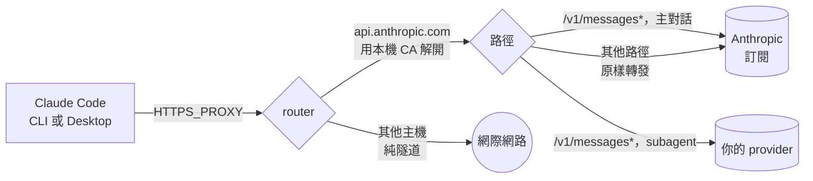

# subagent-handoff

讓 Claude Code 的主對話繼續走你的 claude.ai 訂閱，同時把子代理（subagent）的流量導到你另外付費的第三方供應商。

<p>
  <a href="https://github.com/1morr/subagent-handoff/actions/workflows/test.yml"></a>
  <a href="LICENSE"></a>
  
</p>

[English](README.md) · **繁體中文**

ultracode 與 Workflow 會一次展開好幾十個子代理，claude.ai 訂閱的 5 小時額度撐不過這種用法。子代理吃掉大部分 token，卻不是最需要推理品質的那一段，所以這個路由器把它們送到便宜的供應商，主對話留在訂閱上、完全不受影響。

> [!WARNING]
> **使用前請先讀完這一段。**
> - **非官方工具。** 與 Anthropic PBC 沒有任何隸屬、背書或贊助關係。
>   Anthropic 明確表示不支援把 Claude Code 指向非 Claude 的模型。
>   壞了，要自己修。
> - **你的資料會完整送到第三方手上。** 每一個被路由出去的請求都帶著完整內容 ——
>   system prompt、你的原始碼、檔案內容、工具輸出，全部都在裡面。
>   選擇路由子代理的目的地時，請只選你願意把整個 repository 送過去的地方。
> - **你的 claude.ai OAuth token 會經過這個本機 proxy。** 它會原封不動地轉發給
>   Anthropic，絕對不會送到任何第三方供應商
>   （[保證這件事的程式碼](src/proxy.mjs)，以及釘住這個行為的測試）。
> - 第三方用量會計入你自己的 API key。這個工具不會修改或偽造任何帳務身分，
>   也不會繞過任何人的用量限制。請自行對照每個供應商的條款確認合規性。
>   使用風險自負。


## 為什麼這樣可行

引用自 Claude Code 官方的 [LLM gateway 文件](https://code.claude.com/docs/en/llm-gateway)：

> **Setting only that variable** (`ANTHROPIC_BASE_URL`)**, without a gateway
> credential, doesn't replace the subscription.** Requests still route through
> the gateway, but a saved claude.ai login remains the active credential, so its
> usage limits and billing apply.

所以只要你**不**設定 `ANTHROPIC_AUTH_TOKEN`、`ANTHROPIC_API_KEY` 或 `apiKeyHelper`，Claude Code 就會把它的訂閱 OAuth token 送給這個 router，router 再依每個請求決定要送去 Anthropic（訂閱額度支付）還是第三方（你的 API key 支付）。

這個分流判斷依據的是 [gateway protocol](https://code.claude.com/docs/en/llm-gateway-protocol) 裡的一個 header：

> `x-claude-code-agent-id` — Identifier of the subagent that issued the request,
> **present only on requests from an agent Claude Code spawned inside the session**.

用 header 判斷、而不是用 model 名稱判斷，這件事很重要，因為 Workflow 的 `agent()` 只接受 `sonnet | opus | haiku | fable` 這幾個別名 —— 你在 workflow script 裡根本沒辦法指名一個第三方模型。

## 快速開始

Node 20+。沒有任何 npm 依賴套件。

```bash
git clone https://github.com/1morr/subagent-handoff.git
cd subagent-handoff
npm start
```

第一次執行會建立 `config.json`。**預設什麼都不會被路由出去** —— 內建的「all subagents」規則出廠時是停用的，因為在還沒填供應商 key 的情況下，啟用它只會讓每個子代理都收到 401。

打開 <http://127.0.0.1:8788>：

1. **Providers** —— 填入 Base URL、API Key 與 Model，按「執行測試」，確認「必要」項目全過。「能力」項目沒過，Claude Code 照樣跑得起來，只是子 agent 用到那個能力時靜默失效，見[內建的測試](docs/providers.md#內建的測試)。
2. **Routing** —— 勾選「all subagents → your provider」規則來啟用它。
3. **Connect** —— 複製 `settings.json` 片段，重新啟動 Claude Code。
4. 執行 `/status`，確認 `Login method` 仍然指向你的 claude.ai 帳號。
5. 派一個子代理去做點事，然後在 **Rack** 分頁看分流結果。

## HTTPS proxy 模式（選用，給 Claude Desktop）

**預設關閉**，關著的時候 router 的行為跟上面描述的完全一樣。只有想讓 Claude Desktop 也被分流時才需要打開。

**為什麼需要：** Claude Desktop 的 Code 分頁不理 `ANTHROPIC_BASE_URL`，所以它的請求根本不會到 router。但它照讀 `HTTPS_PROXY` 與 `NODE_EXTRA_CA_CERTS`。

**怎麼運作：** 關閉時，是 Claude Code 主動把 API 請求**送到** router；開啟時，Claude Code 以為自己直連 Anthropic，是 router 以 HTTPS 代理的身分在半路把連線接下來：



`/v1/messages*` 的分流兩種模式是同一段程式，差別只在請求怎麼進到 router。

| | 關閉（預設） | 開啟 |
|---|---|---|
| 能接的 client | CLI | CLI、Claude Desktop |
| Claude Code 的設定 | `ANTHROPIC_BASE_URL` | `HTTPS_PROXY` + `NODE_EXTRA_CA_CERTS` |
| 經過 router 的連線 | 只有 API 請求 | Claude Code 與它啟動的程式的所有 HTTPS 連線；只解開 `api.anthropic.com` |
| router 沒在跑時 | API 請求失敗 | Claude Code、git、npm… 全部斷網 |
| 本機 CA | 沒有 | 有，只能簽 `api.anthropic.com` |

**怎麼打開：** 在**接入**分頁最上面勾選開關（或設 `"httpsProxy": true`），按儲存 —— router 當場切換，不用重啟 —— 再把分頁給出的片段放進 Claude Code 的設定、重開 Claude Code。關掉時要把設定改回 `ANTHROPIC_BASE_URL`。

**會不會封號：** 沒有人能保證。兩種模式下，主對話請求的 token 與 body 都原樣，但都是由 router 發出的：TLS 指紋是 Node 的，還多了兩個 Node `fetch` 自己加的 header。開啟之後，登入、遙測、Remote Control、voice 也改由 Node 發出。實測細節、完整的圖、全域與單一 repo 的設定方式與風險分析見 [docs/https-proxy.md](docs/https-proxy.md)。

## 兩種請求類型

| Condition | How it is detected | Who it is |
|---|---|---|
| `main` | 沒有 `x-claude-code-agent-id` | 你在輸入框裡打字 |
| `subagent` | 帶有 `x-claude-code-agent-id` | Claude Code 派生的任何 agent。**Workflow 與 ultracode 的 `agent()` 呼叫全部落在這裡**，子代理再派生的 agent 也是 |

沒帶 agent id 的背景請求都算 `main`，跟著 `main` 的規則走：session 標題、上下文壓縮、額度探針，以及 **auto mode 的權限分類器** —— 就算它判的是子代理的動作也一樣。把 `main` 分到 provider，auto mode 就由那個 provider 的模型判定，不是 Claude。每一種請求怎麼分類、兩種模式下走哪裡的實測見 [docs/request-map.md](docs/request-map.md)。

## 設定

這個 GUI 是 `config.json` 的完整前端介面，所有東西都能在裡面編輯。規則會由上到下依序判斷，第一個符合的就採用。

| Field | |
|---|---|
| `proxyPort` / `adminPort` | 8787 與 8788。改這兩個需要重新啟動；其他所有設定都是逐請求即時生效 |
| `httpsProxy` | 給 Claude Desktop 用的 HTTPS proxy 模式，預設 `false`。在 GUI 存檔就當場切換 |
| `providers[].baseUrl` | 必須說 Anthropic Messages 格式 —— router 會對 `{baseUrl}/v1/messages` 發送請求 |
| `providers[].model` | 送出前改寫 `model`。留空 = 不動它 |
| `providers[].authStyle` | `bearer` 或 `x-api-key` |
| `rules[].match` | `main` 或 `subagent`，可再用 `modelGlob` 進一步縮小範圍 |
| `rules[].providerId` | 指定哪個供應商，或用保留值 `passthrough` 把請求送回訂閱額度 |
| `rules[].modelOverride` | 改寫 `model`，優先權高於 `providers[].model`。對 `passthrough` 一樣有效 |

沒匹配到任何規則的請求一律送去 `https://api.anthropic.com`，憑證原封不動轉發；這個目標是固定的。完整參考文件（含舊版 `config.json` 下次存檔時會少掉哪些欄位）：[docs/configuration.md](docs/configuration.md)。

**有兩件事值得知道。** 第三方額度用完時，把那條規則的目標切成 `passthrough`，而不是直接停用它 —— 停用會讓流量往下掉到*下一條*規則，而指到 passthrough 才是真正把它停在訂閱額度上。另外，`modelOverride` 是唯一能讓子代理使用跟主對話不同模型的方法，因為 `agent()` 在沒有指定模型時會繼承主對話的模型，而這件事 Claude Code 本身沒辦法改。

## router 對請求做了什麼

每個請求只會走兩條線的其中一條。以下這些都沒有開關。

| | 訂閱線 | Provider 線 |
|---|---|---|
| 哪些請求 | 主對話、沒命中任何規則的、規則指向 `passthrough` 的，以及所有不是 JSON `/v1/messages*` 的請求 | 命中「指向 provider」規則的請求 |
| 送去哪裡 | `https://api.anthropic.com` ＋原本的路徑與 query | `{baseUrl}` ＋原本的路徑與 query |
| Header | 原樣轉發，只拿掉 `host`、hop-by-hop header 與 `accept-encoding` | 從零組起：`content-type`、provider 自己的 key，以及從 Claude Code 帶過去的 `anthropic-version`、`anthropic-beta`、`accept`。你的 OAuth token、cookie 與 `x-claude-code-*` header 一律不送 |
| Body | 原始 bytes。只有規則的 `modelOverride` 會改寫 `model` | 改寫 `model`（規則的 `modelOverride` 優先，其次 provider 的 `model`），拿掉 `metadata`，工具 schema 裡的 `pattern` 把 `\0` 換成等價的 `\x00`（DeepSeek 編不動前者）。其餘一個字不動：`thinking`、`output_config`、`context_management`、`cache_control`、對話中間的 `system` 訊息 |
| 回應 | 邊收邊轉，原樣交回 | 邊收邊轉，原樣交回；唯一例外是 OpenAI 措辭的 context 超限錯誤，會改寫成 `prompt is too long: <requested> tokens > <limit> maximum`（數字照搬），讓 Claude Code 先壓縮而不是直接失敗 |

兩條線上 router 都不自己重送 —— Claude Code 本來就會。連不上上游時回 `502`；串流中途斷掉就把連線切斷，讓 Claude Code 重送；body 超過 64 MiB 回 `413`。這些改寫都不動到快取的 prompt 前綴，拿掉 `metadata` 反而讓 DeepSeek 能跨 session 共用快取。每一筆改了什麼，流量記錄的「送出前改寫」都看得到。細節見 [docs/providers.md](docs/providers.md#router-對請求改了什麼) 與 [docs/reliability.md](docs/reliability.md)。

## 安全模型

- 兩個伺服器都只綁定在 `127.0.0.1`。
- admin API 會驗證 `Origin` 與 `Host`，所以網頁沒辦法操控它，DNS rebinding 也不管用。
- 儲存的 API key 永遠不會回傳給瀏覽器 —— GUI 拿到的只是遮蔽過的提示字串和一個 `__keep__` 標記值。
- `config.json` 與 `traffic.log` 都是以 `0600` 權限寫入。
- 流量記錄只存 metadata：不含請求內容、不含 header，也不含憑證。
- 供應商請求一律從一組空的 header 開始組建，只從 client 帶過去 `anthropic-version`、`anthropic-beta` 與 `accept`，所以不會不小心把 client 端的憑證帶出去。有一個測試會斷言這件事。
- 送去供應商的請求一律拿掉 `metadata`：Claude Code 在裡面放了你 claude.ai 帳號的 `account_uuid` 與 `device_id`。訂閱那條線不受影響。有一個測試會斷言這件事。
- HTTPS proxy 模式的 CA 只能簽 `api.anthropic.com`（`nameConstraints`），私鑰以 `0600` 寫入，而且不裝進系統信任庫。有一個測試證明它替別的主機簽的證書會被拒絕。

詳細內容與威脅模型：[docs/security.md](docs/security.md)。

## 開發

```bash
npm test     # node --test, no dependencies, no network
```

零 runtime 與 dev 依賴是刻意設下的限制 —— 請維持這個狀態。CI 會在 Ubuntu 與 Windows 上跑 Node 20/22/24 三個版本的完整測試。

## 文檔

深入的文檔以繁體中文撰寫。

| | |
|---|---|
| [docs/configuration.md](docs/configuration.md) | 每個設定欄位、寫死的值，以及舊設定檔會少掉什麼 |
| [docs/routing.md](docs/routing.md) | 規則匹配、model 覆寫、額度切換 |
| [docs/observability.md](docs/observability.md) | 流量記錄、快取命中率，以及怎麼看懂 Rack 分頁 |
| [docs/reliability.md](docs/reliability.md) | 為什麼失敗直接交回 Claude Code，以及串流中途斷線 |
| [docs/providers.md](docs/providers.md) | 供應商相容性筆記、內建測試與實測數據 |
| [docs/claude-code-request-shapes.md](docs/claude-code-request-shapes.md) | Claude Code v2.1.274 實際送出的請求形狀，以及 DeepSeek 對每一種的實測反應 |
| [docs/security.md](docs/security.md) | 威脅模型，以及哪些有保護、哪些沒有 |
| [docs/request-map.md](docs/request-map.md) | Claude Code 送出的每一種請求、怎麼被分類、兩種模式下走哪裡，包括 auto mode 的分類器 |
| [docs/https-proxy.md](docs/https-proxy.md) | 給 Claude Desktop 用的 HTTPS proxy 模式：運作方式、本機 CA、實測、地雷 |

## 授權

[MIT](LICENSE)
