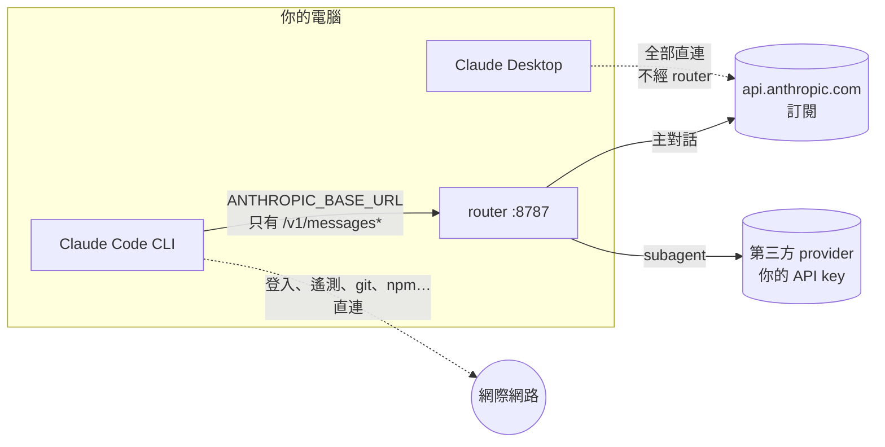
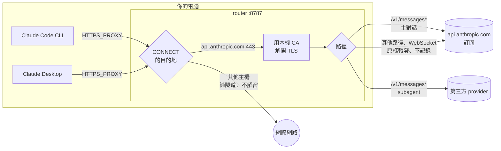
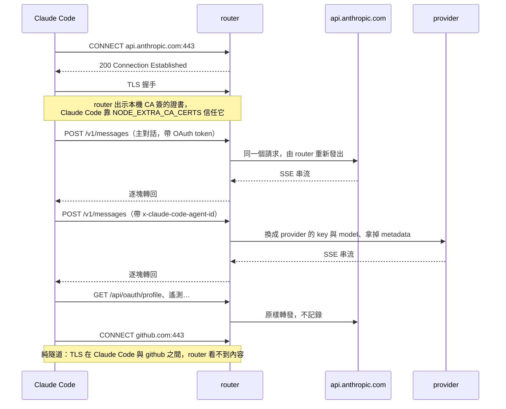

# HTTPS proxy 模式

> 選用功能，**預設關閉**。關著的時候 router 跟沒有這個功能時一模一樣：不收 `CONNECT`、
> 不產生 CA，接入分頁顯示的也是原本的 `ANTHROPIC_BASE_URL` 片段。只用 CLI 就不必打開它；
> 它多出一把本機 CA 與一條 MITM 路徑，換來的是 Claude Desktop 也能接。

## 一句話

關閉時，Claude Code **主動**把 API 請求送到 router（`ANTHROPIC_BASE_URL`）；開啟時，
Claude Code 以為自己直連 Anthropic，是 router 以 HTTPS 代理的身分**在半路把它接下來**
（`HTTPS_PROXY`），解開之後交給同一套分流。

## 為什麼需要

`ANTHROPIC_BASE_URL` 在 Claude Desktop 的 Code 分頁裡不管用。官方文檔寫明 Desktop 的
gateway 路由「從它自己的第三方推論設定讀，不讀 `ANTHROPIC_BASE_URL` 或 `settings.json`」
（[LLM gateway 文檔的 Desktop app 一節](https://code.claude.com/docs/en/llm-gateway-connect)）。
Desktop 自己的「Configure Third-Party Inference」會用 gateway 憑證頂掉 claude.ai 登入，
主對話就不再走訂閱，這個 router 存在的前提也就沒了。

Desktop 照讀的是代理與 CA 變數：用 claude.ai 登入的本機、SSH、WSL Code 分頁 session
「不由 app 管連線，Claude Code 從每一層設定讀這些變數，跟終端機 session 一樣」（v2.1.217 起，
[network-config 文檔](https://code.claude.com/docs/en/network-config)）。所以改從
`HTTPS_PROXY` 接進來。來源是 [issue #2](https://github.com/1morr/subagent-handoff/issues/2)。

## 原理

### 關閉（預設）



### 開啟



兩張圖的右半邊一樣：`/v1/messages*` 走的是同一段程式（`src/proxy.mjs`），分流規則、改寫、
流量記錄都只有一份。差別只在請求怎麼進到 router。

### 一次請求走一遍（開啟時）



只把 `/v1/messages*` 交給分流，是為了跟關閉時看到一樣的流量：關閉時 router 本來就只收得到
`/v1/messages` 與 `/v1/messages/count_tokens`（實際的 traffic.log 4666 筆裡沒有別的）。解開之後
看得到的東西多得多，一個 `claude -p` 就多出 14 筆登入、feature flag、遙測，全記下來流量記錄與
進條的統計就被淹掉。

程式碼：`src/connect.mjs`（CONNECT、隧道、轉發）、`src/ca.mjs`（CA 與證書）。

## 開與關的差別

| | 關閉（預設） | 開啟 |
|---|---|---|
| 能接的 client | Claude Code CLI | CLI、Claude Desktop |
| Claude Code 的設定 | `ANTHROPIC_BASE_URL` | `HTTPS_PROXY` + `NODE_EXTRA_CA_CERTS` |
| Claude Code 以為自己連到 | 自訂的 base URL | `api.anthropic.com`（直連） |
| 經過 router 的連線 | 只有 API 請求（`/v1/messages*`） | Claude Code 與它啟動的程式的**所有** HTTPS 連線 |
| router 解開、看得到內容的 | `/v1/messages*`（本來就是明文送來） | 所有送往 `api.anthropic.com` 的請求；其他主機看不到 |
| 分流、改寫、流量記錄 | `/v1/messages*` | 完全相同 |
| router 沒在跑時 | API 請求失敗 | Claude Code 與它的 git / npm **全部斷網** |
| 本機 CA | 沒有 | 有，只能簽 `api.anthropic.com` |
| Remote Control | CLI 停用（base URL 指向非 Anthropic 主機） | Desktop 可用；CLI 要全域改用這個模式才行 |
| voice mode（CLI） | 直連 Anthropic | 經 router 原樣轉發 |

## 送出了什麼

2026-09-25 在本機用一台假上游接住 router 送出的請求，跟 Claude Code 送進來的逐項比對
（量測腳本沒有進 repo）：

| 請求 | 送去哪 | body | header 跟 Claude Code 送的相比 | 誰發起 TLS |
|---|---|---|---|---|
| 主對話 `/v1/messages` | Anthropic | 原樣（規則指定換 model 時只改 `model`） | 多 `accept-language: *`、`sec-fetch-mode: cors`；`accept-encoding` 換成 `gzip, deflate`；client 沒帶 `accept` 時補 `*/*`。這些是 Node `fetch` 自己加的 | router（Node） |
| subagent `/v1/messages` | provider | 換 `model`、拿掉 `metadata`、修上游編不動的 `pattern` | 從零組起：只帶 `anthropic-version`、`anthropic-beta`、`accept`、`content-type` 與 provider 的 key。`user-agent` 變成 `node`；訂閱的 OAuth token、`x-app`、session id 都不會送出 | router（Node） |
| 其他 `api.anthropic.com` 路徑（只有開啟時才經過 router） | Anthropic | 原樣 | 原樣（只有逐跳的 `connection`） | router（Node） |
| WebSocket（voice mode） | Anthropic | 原樣 | 請求頭原樣 | router（Node） |
| 其他主機（github、npm…） | 原目的地 | router 看不到 | router 看不到 | Claude Code 自己 |

前兩列兩種模式都一樣；第三、四列是開啟之後才多出來的，關閉時那些請求由 Claude Code 自己直連。

## 會不會被封號

**沒有人能保證不會。** 這是非官方用法，Anthropic 明說不支援把 Claude Code 指向非 Claude 模型。
這個工具不偽造帳號身分、不改計費、不繞過額度，但它改變了 Anthropic 那一端看到的連線樣貌。
以下是實際的差異，判斷交給你：

- **兩種模式都一樣的：**
  - 帳號、OAuth token、主對話的 body 原樣送到 Anthropic。
  - 主對話請求是 router 發出的：TLS 指紋是 Node（OpenSSL）的，不是 Claude Code（Bun）的；
    header 多了上表那幾個。
  - 分到 provider 的 subagent 請求根本不會到 Anthropic。Claude Code 自己的遙測照常原樣送出，
    裡面**可能**看得出 subagent 在活動、卻沒有對應的 API 請求 —— 這一點是推測，沒有驗證遙測內容。
- **開啟後多出來的：** 登入、遙測、feature flag、Remote Control、voice 這些連線，header 雖然原樣，
  但也改由 Node 發出。從 Anthropic 那端看，「TLS 指紋不像 Claude Code」的連線從只有推論請求
  變成全部。
- **開啟後少掉的：** Claude Code 不再知道自己設了自訂 base URL，所以不會因此停用 Remote Control。
  這對判定是加分還是減分，我們不知道。

想把風險壓低：只在要用 Desktop 時才打開；分流規則只動 subagent、主對話留在訂閱；
不要設 `CLAUDE_CODE_ATTRIBUTION_HEADER=0`（它會讓訂閱線的輔助請求被拒，見
[claude-code-request-shapes.md](claude-code-request-shapes.md#訂閱線會檢查-system-的開頭)）；
並自行對照 Anthropic 的使用條款。

## 開關

GUI 接入分頁最上面的「HTTPS proxy 模式」，勾選後按**儲存**：**router 當場切換，不用重啟。**
（直接手改 `config.json` 的 `"httpsProxy"` 則跟其他手改一樣，下次啟動才生效。）

- **打開：** 第一次打開時在 `config.json` 旁邊產生 CA，proxy 埠開始接受 `CONNECT`。
- **關掉：** 拿掉 `CONNECT` 監聽，**還開著的隧道與解開的連線一起斷掉**，之後的 `CONNECT` 直接被斷線；
  不再讀 CA。CA 檔案留著，下次打開不必重新設定信任。
- 先切換再存檔：切換失敗（例如 CA 寫不進去）就不存，GUI 顯示錯誤，設定檔不會跟實際狀態不一致。

接入分頁會一直標出 router **此刻實際**在哪個模式；勾了還沒存時說明按下儲存會發生什麼；剛切換完時提醒
Claude Code 那邊還沒變。**router 切換了，Claude Code 不會跟著變**：它的 `settings.json` 要換成新的片段、
再重開（Desktop 開新 session）。關掉時這一步特別重要：還留著 `HTTPS_PROXY` 的話，router 不收 `CONNECT`，
Claude Code 的所有連線都會失敗。

「關掉＝原行為」由 `test/connect.test.mjs` 守著：不掛 `CONNECT`、沒打開過就不產生 CA、guard 的例外
不存在；執行中關掉時監聽被拿掉、開著的隧道被斷，再打開不用重啟。

## 設定 Claude Code

模式打開之後，接入分頁會給出填好 CA 路徑的片段。放在哪一層決定影響範圍：

**全域 —— `~/.claude/settings.json`（CLI 與 Desktop 共用）**

```json
{
  "env": {
    "HTTPS_PROXY": "http://127.0.0.1:8787",
    "NODE_EXTRA_CA_CERTS": "<config.json 旁邊的 https-proxy-ca.pem>"
  }
}
```

同時拿掉 `ANTHROPIC_BASE_URL`。兩個都設不會出錯，但 CLI 的 API 請求會走 base URL 那條，
而且 CLI 的 Remote Control 會因為它被停用。

**只在某個 repo —— `<repo>/.claude/settings.local.json`**（不要用會提交的 `settings.json`：
CA 路徑是機器專屬的）

```json
{
  "env": {
    "ANTHROPIC_BASE_URL": "https://api.anthropic.com",
    "HTTPS_PROXY": "http://127.0.0.1:8787",
    "NODE_EXTRA_CA_CERTS": "<CA 路徑>"
  }
}
```

`ANTHROPIC_BASE_URL` 那行是給 CLI 的：蓋掉全域那個指向 router 的值，讓 API 請求也走 proxy。
Desktop 本來就不理它。專案層的 `env` 要在信任這個資料夾之後才生效（第一次開啟時會問）。

**兩種放法的差別（2026-09-25 實測）**

| | 全域 | 只在 repo |
|---|---|---|
| 分流、分到第三方 provider（CLI / Desktop） | ✅ | ✅ |
| Remote Control（Desktop） | ✅ | ✅ |
| Remote Control（CLI） | ✅ 前提是全域已經沒有 `ANTHROPIC_BASE_URL` | ❌ `claude remote-control` 只看使用者層的 `ANTHROPIC_BASE_URL` |
| voice mode（CLI） | ✅ | ✅ |
| Desktop 的聽寫按鈕 | 不經過 router | 不經過 router |
| router 沒在跑時 | 所有專案的 Claude Code 與它啟動的 git / npm 都斷網 | 只有這個 repo |
| 背景 agent（`claude agents`、`--bg`） | 官方建議把代理變數放在這一層 | 沒量過 |

設好之後重開 Claude Code（Desktop 開新的 session），`/status` 應該看到 `Proxy` 指向 router、
`Additional CA cert(s)` 是 CA 路徑，`Login method` 仍然是 claude.ai 帳號。

## 本機 CA

- 第一次啟動時產生，放在 `config.json` 旁邊：`https-proxy-ca.pem`（證書）與
  `https-proxy-ca-key.pem`（私鑰，0600）。兩個都在 `.gitignore` 裡。
- ECDSA P-256，效期十年。伺服器證書每次啟動重簽一張，只放在記憶體裡。
- **nameConstraints 限定只能簽 `api.anthropic.com`。** 私鑰外洩的話，拿它簽別的網域，
  驗證端會以 `permitted subtree violation` 拒絕；簽 IP 位址（iPAddress SAN）則以
  `excluded subtree violation` 拒絕。`test/ca.test.mjs` 用真的 TLS 握手驗這兩件事。
  只列允許的網域擋不住 IP —— RFC 5280 的 permittedSubtrees 只管它列出的名稱種類 ——
  所以另外把全部 IPv4／IPv6 位址列為排除。2026-09-25 之前產生的 CA 沒有這段排除，
  刪掉兩個檔案讓它重新產生即可。
- **不要裝進系統信任庫。** 只透過 `NODE_EXTRA_CA_CERTS` 給 Claude Code 用。瀏覽器不信任它，
  所以就算瀏覽器的流量經過 router，也解不開。
- 證書是 `src/ca.mjs` 手工用 DER 拼出來的：Node 只會解析 X.509、不會產生，而這個專案零依賴。
- 刪掉這兩個檔案，下次啟動就會產生新的一組。路徑不變，但 Claude Code 要重開才會讀到新證書。

## 實測（2026-09-25，Windows）

**CLI（Claude Code 2.1.281）。** 用 `claude -p` 設 `HTTPS_PROXY` 與 `NODE_EXTRA_CA_CERTS`、
不設 `ANTHROPIC_BASE_URL`，叫它開一個 subagent：

- debug log 有 `CA certs: Appended extra certificates from NODE_EXTRA_CA_CERTS`，握手成功，
  nameConstraints 沒有讓 Claude Code 的 TLS 堆疊拒絕。
- 主對話記成 `main`、subagent 記成 `subagent`，跟 `ANTHROPIC_BASE_URL` 模式一樣。
- 原樣轉發的登入、bootstrap、遙測都正常，session 照常跑完。
- 不給 CA 時 Claude Code 自己回 `SSL certificate verification failed
  (UNABLE_TO_VERIFY_LEAF_SIGNATURE) … set NODE_EXTRA_CA_CERTS`，router 的 console 也印出提示。

**Desktop（2.7032.0.0，Microsoft Store 版，內嵌 Claude Code 2.1.280）。** 兩個變數只放在一個
測試資料夾的 `.claude/settings.local.json`，`~/.claude/settings.json` 裡照舊是指向另一台 router
的 `ANTHROPIC_BASE_URL`。在 Code 分頁（Local、claude.ai 登入）開那個資料夾，叫它開一個 subagent：

- 51 筆請求全部經過這台 router、全部 200：主對話 `/v1/messages` 6 筆、subagent 1 筆（分類正確）、
  `/v1/messages/count_tokens` 44 筆。流量記錄的 session id 對得上 Desktop 自己的 session 檔。
- 專案層的設定就夠：官方文檔說 claude.ai 登入的本機 session 每一層都讀，實測相符。
- `count_tokens` 比 CLI 多得多（CLI 在 master 的 4666 筆裡才 75 筆），推測是介面在算 context 用量。
  走訂閱線，不影響分流，但會佔掉流量記錄的篇幅。
- Store 版 Desktop 的資料在 `%LOCALAPPDATA%\Packages\Claude_<id>\LocalCache\Roaming\Claude\`
  （`claude_desktop_config.json`、內嵌的 `claude-code\<版本>\`、`claude-code-sessions\`），
  不在一般的 `%APPDATA%\Claude`：MSIX 會把 AppData 重導到套件自己的目錄。

**第二輪（Desktop 2.9939.2.0，CLI 2.1.282）。** 測試用的 launcher 另外把 CONNECT、原樣轉發的
請求與 upgrade 印出來（只在測試時用，沒有進 repo）。

- **分到第三方 provider：** 規則設成 subagent → DeepSeek。CLI 與 Desktop 各開一個 subagent，
  都被送到 DeepSeek、model 改寫成 `deepseek-flash`、回 200；主對話照走訂閱。
- **Remote Control（Desktop）：** 在 Desktop 的 session 裡 `/remote-control`，註冊與心跳全部經
  router 原樣轉發（`POST /v1/code/sessions`、`…/bridge`、`…/worker`、`…/worker/events`、
  `…/worker/heartbeat`，都是 200）。從 claude.ai/code 送一句話，本機 session 收到、推論請求經
  router 走訂閱、回答出現在網頁上。
- **Remote Control（CLI）測不了：** `claude remote-control` 在讀專案設定之前就拿使用者層的
  `ANTHROPIC_BASE_URL` 做資格檢查，專案層覆寫成 `https://api.anthropic.com` 也壓不過；
  `--setting-sources` 放在 `remote-control` 前面則直接被拒。要在 CLI 用，得從使用者層拿掉
  `ANTHROPIC_BASE_URL`，也就是整台機器改用 HTTPS proxy 的接法。
- **voice mode（CLI）：** `/voice tap` 之後錄音，router 看到
  `UPGRADE /api/ws/speech_to_text/voice_stream`，Anthropic 回 `101`，音訊經 WebSocket 送出，
  轉寫結果回到 CLI 並自動送出。
- **Desktop 的聽寫不走這條路：** 輸入框旁的聽寫按鈕能轉寫，但 router 什麼都沒看到 ——
  那是 app 自己連線，不經內嵌的 CLI，也就不吃 `HTTPS_PROXY`。proxy 模式影響不到它。

**還沒實測：** Desktop 的 SSH / WSL session（官方文檔說它們跟本機 session 一樣讀這些變數）。

## 怎麼驗的

**自動測試（`npm test`，每次提交都跑，CI 在 Ubuntu / Windows × Node 20 / 22 / 24）**

| 測試 | 驗的是 |
|---|---|
| `test/ca.test.mjs` | 用真的 TLS 握手：CA 簽的證書驗得過；同一把 CA 替別的網域、或替 IP 位址簽的會被 nameConstraints 拒絕；不信任這把 CA 的 client 握手失敗；2050 年後的到期日編碼；CA 落檔後原樣讀回 |
| `test/connect.test.mjs`（開啟） | 經 CONNECT 解開的子 agent 請求分到 provider、訂閱 token 不會跟過去；主對話原樣走訂閱；其他路徑原樣轉發且不進流量記錄；其他主機走隧道；目的地連不上回 502；解析不出目的地回 400；client 不信任 CA 時提示去查 `NODE_EXTRA_CA_CERTS`；WebSocket upgrade 原樣接到上游 |
| `test/connect.test.mjs`（關閉） | 不掛 CONNECT、不產生 CA、CONNECT 直接被斷；guard 的例外只在開啟時存在；明文送來、Host 寫 `api.anthropic.com` 的請求照樣 403 |
| `test/config.test.mjs` | `httpsProxy` 預設關閉，只有布林 `true` 才打開 |

「關閉」那三個測試做過變異驗證：把 guard 的開關判斷拿掉、讓 `setupHttpsProxy` 無視 `enabled`，
對應的測試會紅；改回來才綠。這一步是手動做的，沒有寫進測試。

**端到端（2026-09-25，手動，細節見上面的「實測」）**

- 測試用的 router 跑在另外的埠（18787 / 18788），設定檔是副本，全域設定與正在用的 router 不動；
  Claude Code 那邊只在一個測試資料夾的 `.claude/settings.local.json` 設變數。
- 真的 Claude Code：CLI 用 `claude -p … --debug-file`，看 `CA certs: Appended …` 等行。
- Claude Desktop：用 Orca 的 computer use 操作介面（開資料夾、送訊息、`/remote-control`、聽寫），
  系統資料夾選擇視窗用 Windows UI Automation 填路徑。
- Remote Control：從 Chrome 開 claude.ai/code 上的那個 session 送一句話，看本機有沒有收到、回答
  有沒有回到網頁。
- voice mode：CLI 開 `/voice tap`，錄音時用 Windows 的語音合成從喇叭念一句話給麥克風聽。
- 看 router 做了什麼：測試用的 launcher 另外印出每個 CONNECT、每筆原樣轉發的請求與 upgrade，或包住
  `fetch` 記下送往上游的每一筆（[request-map.md](request-map.md#怎麼驗的)）。
- 「送出了什麼」那張表：一台假上游接住 router 送出的請求，跟送進去的逐項比對 header。
- GUI 用 Playwright 開關兩種模式、檢查片段是合法 JSON；文檔裡的 mermaid 圖用 mermaid 11 渲染過。

這些輔助腳本都沒有進 repo；Claude Code 或 Desktop 升級後要重驗，照上面的做法重做。

## 沒有的功能與已知缺口

- **router 對外不會再經過另一層代理。** 如果你的網路要靠 Clash 之類的系統代理才連得到外面：
  CONNECT 隧道（`net.connect`）與 WebSocket（`tls.connect`）一律直連，`fetch` 與原樣轉發只有在
  router 啟動時帶 `NODE_USE_ENV_PROXY=1` 才會用環境變數裡的代理。Clash 的 TUN 模式在網路層接管，
  不受影響。這一條是讀程式碼得出的，沒有實測。
- **不支援代理認證**（`Proxy-Authorization`）。router 只綁 127.0.0.1，本機任何程式都能拿它當隧道
  —— 它們本來就能自己連出去，所以沒有多開放什麼。
- **只支援 `CONNECT`。** `HTTP_PROXY` 用的明文代理請求（`GET http://…`）會被 guard 以 403 擋下。
- **解開的連線只講 HTTP/1.1。** router 的 TLS 沒有宣告 ALPN，Claude Code 會退回 HTTP/1.1；實測正常。
- **原樣轉發的請求與隧道不進流量記錄**，GUI 上看不到它們。這是刻意的（見上面「原理」），但也代表
  出問題時只能靠 Claude Code 的 debug log 查。
- **換 CA 要重開 Claude Code** 才會讀到新的證書。開關本身存檔即生效，但 Claude Code 那邊的設定改了也要重開。
- **Claude Desktop 的聽寫**不經過 router；**CLI 的 Remote Control** 只有全域設定才行。
- **沒測過**：Desktop 的 SSH / WSL session、背景 agent（`claude agents`、`--bg`）、macOS / Linux 上的
  Desktop、Claude Code 送 CONNECT 時就附帶資料（router 會直接斷線；目前的 client 都等 200 才開始握手）。

## 代價與地雷

- **`HTTPS_PROXY` 會被 Claude Code 啟動的每一支程式繼承**，包括 Bash 工具裡跑的 git、npm、
  curl。它們經 router 原樣隧道出去，但 **router 沒在跑的時候全部斷網**，Claude Code 本身也是。
  不想經過 router 的主機列進 `NO_PROXY`。
- **只處理 `CONNECT`。** `HTTP_PROXY` 用的 absolute-form 明文代理請求（`GET http://…`）
  會被 guard 以 403 擋下，所以不要把 `HTTP_PROXY` 也指過來。
- **不要讓 router 自己走代理。** Node 的 `fetch` 預設不理 `HTTPS_PROXY`，只有設了
  `NODE_USE_ENV_PROXY=1` 或 `--use-env-proxy` 才會
  （[Node 文檔](https://nodejs.org/docs/latest-v24.x/api/http.html#built-in-proxy-support)）。
  帶著這兩者之一、又讓 `HTTPS_PROXY` 指向自己去啟動 router，請求會繞回自己。
- **模式開著時，guard 對解開的請求放行。** 它們的 Host 是 `api.anthropic.com`，必然過不了主機名檢查。
  這條路不必防 DNS rebinding 與 CSRF：網頁的 `fetch` 送不出 `CONNECT`，瀏覽器也不信任這把 CA。
  proxy 那台 server 只收明文，所以「socket 是加密的」就代表是這條路進來的
  （`src/proxy.mjs`）。明文送來、Host 寫 `api.anthropic.com` 的請求照樣被擋；模式沒開時這個例外
  根本不存在。兩件事都有測試守著。
- **握手失敗時 router 會在 console 提示去查 `NODE_EXTRA_CA_CERTS`。** TLS 1.3 下 client
  驗不過證書只會關掉連線，server 端看不到錯誤，只看得到「還沒握完手就關了」，所以 client
  正常中途離開也會觸發這個提示。解開 TLS 用的是自己包的 `TLSSocket`：從 http server 的
  `connect` 事件拿到的 socket 交給 `https.Server` 之後，握手失敗時什麼事件都不發（實測 Node 24）。
