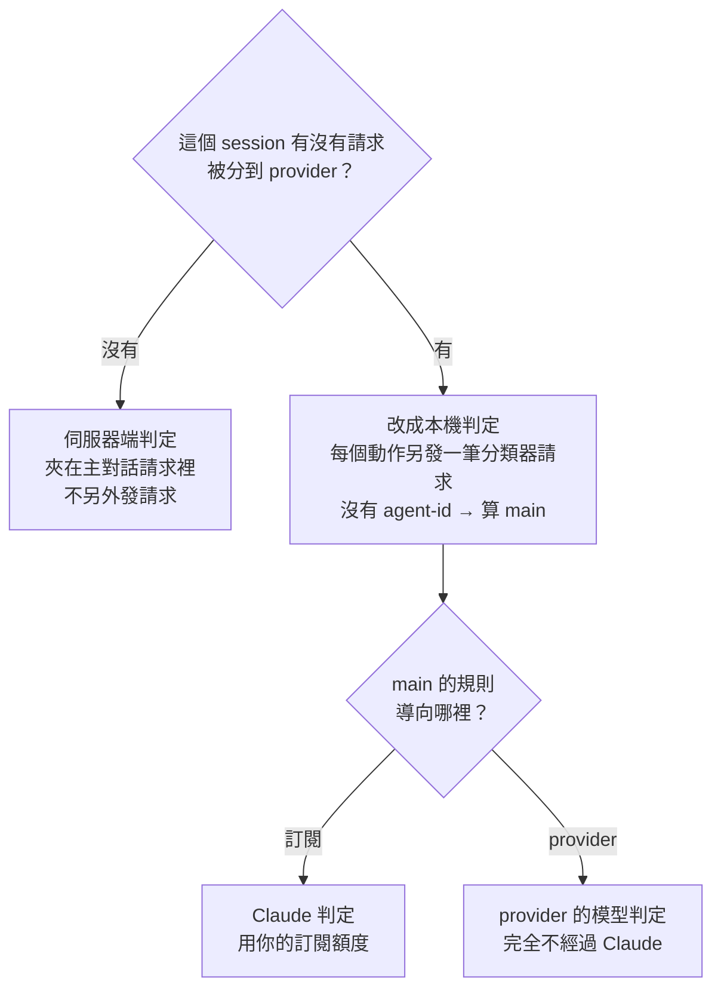

# 每一種請求走哪裡

Claude Code 發出的請求不只有「你打字那一輪」與「子 agent」。這份文件把實際觀察到的每一種請求
列出來：router 怎麼分類它、兩種接入方式（`ANTHROPIC_BASE_URL` 與
[HTTPS proxy 模式](https-proxy.md)）下它走哪裡、最後由誰處理。

觀察的版本是 Claude Code 2.1.281–2.1.282（CLI）與 Desktop 2.9939.2.0，日期 2026-09-25。
Claude Code 升級後可能新增或改掉某些請求，怎麼重新量見文末的「怎麼驗的」。

## router 只看一件事

`/v1/messages*` 的請求有沒有帶 `x-claude-code-agent-id`：有就是 `subagent`，沒有就是 `main`
（[routing.md](routing.md#兩種來源分別是什麼)）。router 不看 system prompt、不看用途。

所以**所有沒帶 agent-id 的輔助請求都算 `main`**：auto mode 的分類器、session 標題、額度探針、
上下文壓縮……它們跟著 `main` 的規則走。把主對話分到 provider，這些會一起過去。

## 推論請求（`/v1/messages*`，會經過分流）

| 請求 | 怎麼認 | agent-id | 分類 |
|---|---|---|---|
| 主對話的每一輪 | 串流；system 第二個 block 是身分行；帶完整工具清單 | 無 | `main` |
| 子 agent 的每一輪（含 Workflow / ultracode `agent()`） | 同上 | 有 | `subagent` |
| auto mode 的本機分類器 | 非串流；system 以 `You are a security monitor for autonomous AI coding agents` 開頭；不帶工具；第一階段 `max_tokens: 64`，分數高才有第二階段 `max_tokens: 8192` | **無，就算判的是子 agent 的動作** | `main` |
| WebSearch 的內部請求 | `tool_choice` 強制 `web_search`（[形狀](claude-code-request-shapes.md#websearch)） | 跟著發起者 | 發起者的分類 |
| session 標題等背景請求 | 非串流、`output_config.format: json_schema`、`thinking: disabled` | 無 | `main` |
| 額度探針 | `max_tokens: 1`、不帶 system | 無 | `main` |
| Claude in Chrome 的輔助請求 | 自帶 system、沒有身分行 | 無 | `main` |
| `/v1/messages/count_tokens` | 路徑；Desktop 送得特別多（一個 session 44 筆） | 跟著發起者 | 發起者的分類 |

這一段在兩種接入方式下完全一樣：都會進 router 的分流、都進流量記錄。

## 其他送往 `api.anthropic.com` 的請求（不經過分流）

| 請求 | 例子 | 關閉時 | 開啟 HTTPS proxy 模式時 |
|---|---|---|---|
| 登入與帳號 | `/api/oauth/profile`、`/api/oauth/account/settings` | Claude Code 直連 | 經 router 原樣轉發，不記錄 |
| 啟動設定、feature flag | `/api/claude_cli/bootstrap`、`/api/claude_code_*`、`/api/organizations/<id>/model_selector/cc` | 直連 | 原樣轉發 |
| 遙測 | `/api/event_logging/v2/batch` | 直連 | 原樣轉發 |
| MCP 目錄 | `/v1/mcp_servers`、`/mcp-registry/v0/servers` | 直連 | 原樣轉發 |
| Remote Control | `/v1/code/sessions`、`…/bridge`、`…/worker`、`…/worker/events`、`…/worker/heartbeat` | CLI 不能用（見下） | 原樣轉發 |
| voice mode | WebSocket `/api/ws/speech_to_text/voice_stream` | 直連 | 原樣轉發（upgrade） |
| WebFetch 網域檢查、`/fast` 可用性檢查 | [官方文檔](https://code.claude.com/docs/en/network-config)說會打 `api.anthropic.com`；這次沒有觸發到 | 直連 | 原樣轉發 |

## 其他主機

`claude.ai`、`platform.claude.com`（登入）、`mcp-proxy.anthropic.com`（claude.ai 的 MCP connector）、
`bridge.claudeusercontent.com`（Claude in Chrome）、Datadog（錯誤回報）、`registry.npmjs.org`、
`github.com`、各個 MCP 伺服器，以及 Bash 工具裡的 git、npm、curl：

- 關閉時：直連，不經過 router。
- 開啟時：經 router 的純 TCP 隧道，router **不解密、看不到內容**，也不記錄。

Claude Desktop 輸入框旁的聽寫按鈕是 app 自己連線，不經內嵌的 CLI，兩種模式都不經過 router。

## auto mode 的分類器走哪裡

auto mode 每個需要權限的動作都要一次安全判定。Claude Code 有兩層：

1. **伺服器端**：把判定需要的脈絡夾在主對話那筆請求裡，Anthropic 在回應裡附上
   `safeguard_results`。不另外發請求。
2. **本機**：回應裡沒有 `safeguard_results`（debug log 的 `server_no_result`）時，Claude Code
   **在這個 session 剩下的時間都改成本機判定**：每個動作另外發一筆上面表格裡的分類器請求。

第三方 provider 不會回 `safeguard_results`。所以只要 session 裡有任何一筆推論請求被分到 provider，
這個 session 就改成本機判定；而本機判定的請求沒有 agent-id，跟著 `main` 的規則走。

實測（`claude -p --permission-mode auto --model sonnet`，叫它跑 `node -e "console.log(6*7)"`，
情境 A 另外跑 `git push --force origin main`，測試 repo 沒有 remote）：

| 情境 | 規則 | 判定由誰做 | 送去哪 | 結果 |
|---|---|---|---|---|
| C（對照） | 沒有規則，全走訂閱 | Anthropic 伺服器端 | 夾在主對話請求裡；沒有任何分類器請求 | `node` 放行 |
| B | 主對話走訂閱，子 agent → DeepSeek；由子 agent 執行指令 | **Claude（sonnet）** | 分類器請求送到**訂閱**：子 agent 的 Bash 一次、子 agent 交回結果（`SubagentHandback`）一次 | `node` 放行（severity 1、2） |
| A | 主對話與子 agent 都 → DeepSeek | **DeepSeek** | 分類器請求送到 DeepSeek；整個流程沒有任何一筆推論請求到 Anthropic | `node` 放行（severity 10）；force push 第一階段 88、第二階段判 `Git Destructive`，**擋下** |

這代表：

- **主對話分到 provider 時，不是免費用到 Claude 的分類器。** 是 provider 的模型在當分類器 ——
  Claude Code 以為自己在用 Claude，照樣把 auto mode 打開，但安全判定的品質取決於那個模型。
  這次 DeepSeek 擋下了 force push，這只說明它在這一個例子上判對了，不代表它擋得住提示注入或更
  隱晦的危險動作。
- **分類器請求帶著完整的脈絡**：第一階段 DeepSeek 回報約 3.1 萬 input tokens（Claude Code 的 debug
  log 記 `classifierChars=127234`）。主對話分到 provider 時，這些本來就會送過去；子 agent 分到
  provider 時，它們反而留在訂閱。
- **只把子 agent 分到 provider，會讓訂閱多花一點**：整個 session 從伺服器端判定改成本機判定，
  每個需要判定的動作（主對話與子 agent 的都算）多一筆分類器請求。第一次約 3 萬 input tokens，
  之後大多命中快取（DeepSeek 上第二、三次各 3 萬多 tokens 讀快取、幾百 tokens 新輸入；訂閱那邊的
  用量沒記到）。每次判定也多 1–2 秒。
- 情境 B 沒測到「擋下」的案例：訂閱上的主對話讀到使用者全域指示裡「永不 `git push --force`」，
  直接拒絕派子 agent 去跑，分類器沒有機會出手。

## 怎麼驗的

- 一台測試用的 router 跑在另外的埠，設定檔是副本（含 provider key，測完刪除）。
- 測試資料夾的 `.claude/settings.local.json` 把 `ANTHROPIC_BASE_URL` 指向那台 router，全域設定不動。
- 測試用的 launcher 在載入 router 之前包住 `globalThis.fetch`，記下 router 對外送出的每一筆請求：
  目的地、model、是否串流、`max_tokens`、system 的開頭（拿掉 attribution block）、工具名稱、
  非串流回應的內容。launcher 只在測試時用，沒有進 repo。
- 對照 Claude Code 的 `--debug-file`：`[auto-mode]`、`[server-classifier]`、
  `classifier_request_started … stage=xml_s1 / xml_s2`、`Auto mode classifier blocked action` 這幾行。
- 「其他送往 `api.anthropic.com` 的請求」那張表來自開啟 HTTPS proxy 模式時的 CONNECT 與轉發紀錄
  （見 [https-proxy.md 的實測](https-proxy.md#實測2026-09-25windows)）。
